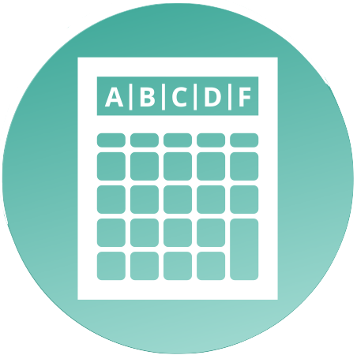

#  Lexxeous's Python Grade Calculator: 

#### Calculate grades.

Use `python grades.py -h` for help and usage.

Usage:
```
usage: grades.py [-h] [-w W_COUNT W_PERC] [-q Q_COUNT Q_PERC]
                 [-t T_COUNT T_PERC] [-p P_COUNT P_PERC] [-a A_COUNT A_PERC]
                 [-m MAX_GRADE] [-s STUDENTS]

Grade calculator. All percentage values must add to 100. There is no limit on
the quantity of assignments. The attendance quantity must be either 0 or 1.

optional arguments:
  -h, --help            show this help message and exit
  -w W_COUNT W_PERC, --homework W_COUNT W_PERC
                        Homework count, Homework percentage value.
  -q Q_COUNT Q_PERC, --quizzes Q_COUNT Q_PERC
                        Quiz count, Quiz percentage value.
  -t T_COUNT T_PERC, --tests T_COUNT T_PERC
                        Test count, Test percentage value.
  -p P_COUNT P_PERC, --projects P_COUNT P_PERC
                        Project count, Project percentage value.
  -a A_COUNT A_PERC, --attendance A_COUNT A_PERC
                        Attendance count, Attendance percentage value.
  -m MAX_GRADE, --max_grade MAX_GRADE
                        Upper bound for potential score; letter grade still
                        calulated based on 100.
  -s STUDENTS, --students STUDENTS
                        Number of students grades to calculate.
```